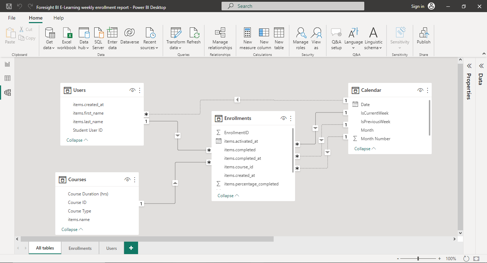

# Foresight BI E-learning Weekly Enrollment Report

## Introduction
This is a Power BI project on the e-learning dataset provided by Foresight BI & Analytics which is a consulting and training firm that specializes in developing Microsoft Power BI reporting solutions and training for individuals and organizations. The goal of the project is to help management make informed decisions on improving student engagement on the platform and the course curriculums.
## Problem Statement
Management wants to understand the weekly performance of the e-learning platform. Among what management wants to determine are:
- Number of new users on the platform compared to the previous week.
- Percentage of new users that enrolled in courses compared to the previous week.
- Active students on the platform compared to the previous week.
- Number of students who completed a course this week compared to the previous week.
## Skills demonstarted
The following Power BI skills were incorporated into this project:
- Data transformation using Power Query Editor.
- Data modelling on Power BI.
- Knowledge of DAX functions. ADDCOLUMNS, CALENDARAUTO, YEAR, MONTH, FORMAT, WEEKNUM, DATE, CALCULATE, DIVIDE, COUNT, VAR, RETURN,  IF, and USERELATIONSHIP functions were used in this project.
- Data visualization on Power BI.
## Data sourcing
The dataset is a (anonymized) real-life dataset provided by Ahmed Oyelowo (MVP, MCSA, MCT, AFM) of Foresight BI & Analytics. Here's the link to the [dataset](https://docs.google.com/spreadsheets/d/1M3INoxFT5tzmjaDOS68TG4xfx7x4LERd/edit?usp=sharing&ouid=109205170271109304266&rtpof=true&sd=true).
## Data transformation
For the analysis, only the Courses, Enrollments, and Users sheet were transformed with Power Query Editor, the datetime columns in the sheets were transformed to date only columns for a clearer and precise analysis. There were no duplicates in the dataset.
## Data modelling
The model uses a star schema with multiple inactive relationships between date columns in the dataset. There are two (2) fact tables and one (1) dimension table. The Courses table (dimension) is joined to the Enrollments table (fact) via a one-to-many relationship. The Users table (fact) is also joined to the Enrollments table via a one-to-many relationship. A separate calendar table (dimension) was created to aid the analysis and since there can be only one active primary key relationship between two tables at a time, it was important to also create inactive relationships to answer the business questions.

## Analysis and Visualization
The report comprise of a single page. Analysis revealed the following:
- Ten new users signed up on the platform this week, representing a 25% increase in sign ups from the previous week.
- Although, nine students enrolled for courses, it was a -10%  decrease from the previous week when ten users enrolled.
- There was an increase of 13% in the number of active students on the platform this week.
- Only two students completed courses this week whereas three students completed course the previous week.

The full report which shows a breakdown of students activities on the platform by course types and course names can be accessed on the Power BI service via this [link]().
## Recommendations
Although the learning platform experienced a drop in enrolled students from the previous week, there was a 25% increase in new users and a 13% increase in active students. These positive trends indicate that the platform is gaining popularity, but action needs to be taken to improve student engagement and retention. To address this, management needs to focus on improving the overall user experience on the platform. This could include making it easier for students to navigate and find courses that are relevant to their interests, improving the quality of the course content, and providing more interactive learning experiences to keep students engaged. Additionally, management should invest in targeted marketing efforts to attract more enrolled students. This could include partnering with universities or other educational institutions, leveraging social media platforms to reach the target audience, and offering promotions or discounts to incentivize students to enroll in courses.

